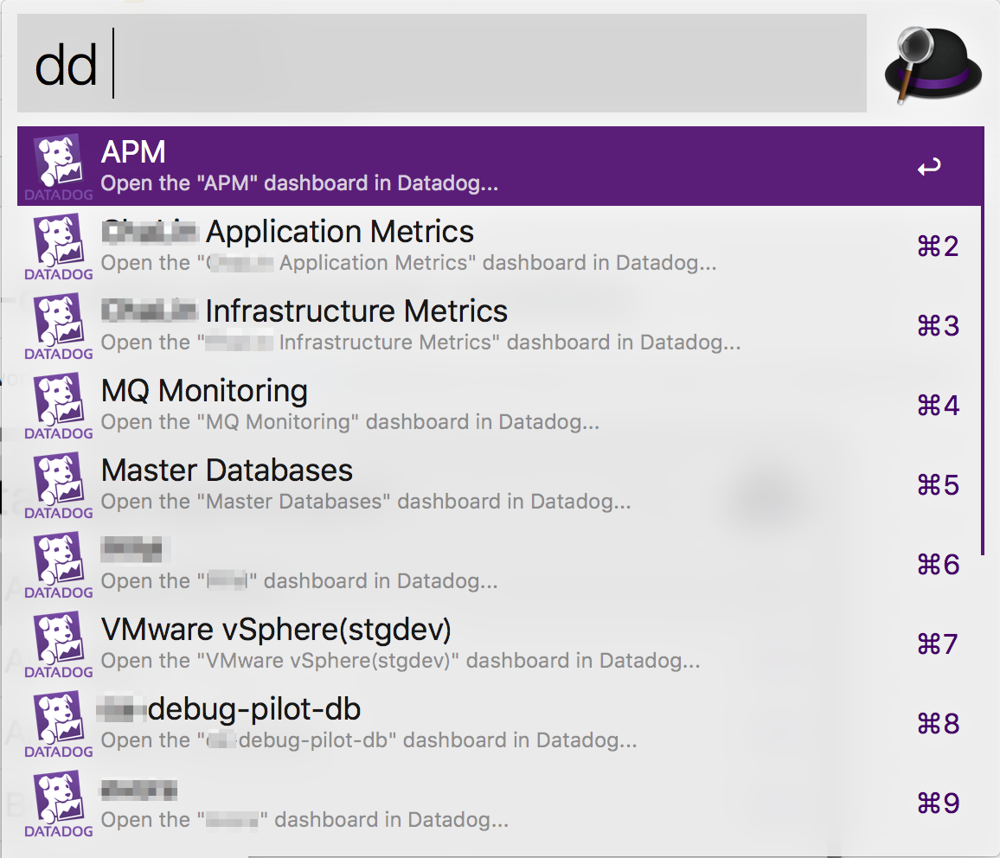
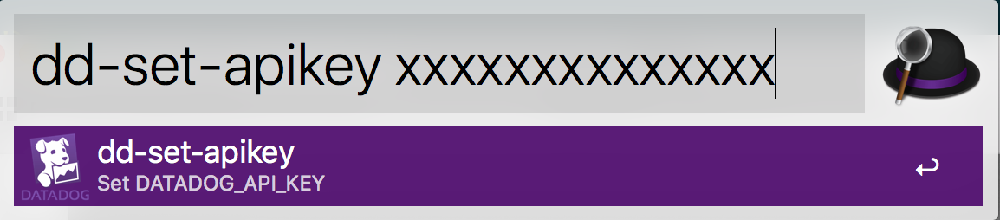
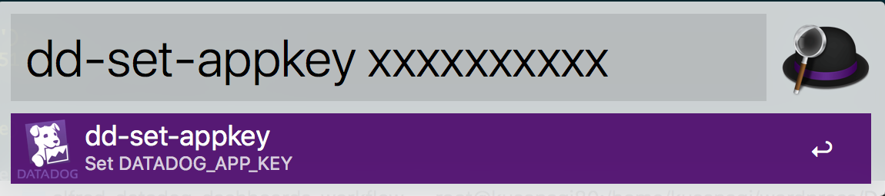

# alfred-datadog-dashboards-workflow

An [Alfred](https://www.alfredapp.com/) workflow to search your [Datadog](https://www.datadoghq.com) dashboards and select one to open in your default browser.



## Installation

Clone this repo and run:

```
bin/install
```

## Configuration

The plugin needs a Datadog API key and Application key. You can find or create one on the ["Integrations" -> "APIs" page](https://app.datadoghq.com/account/settings#api).





This command create and update a file `~/.datadogrc`.
